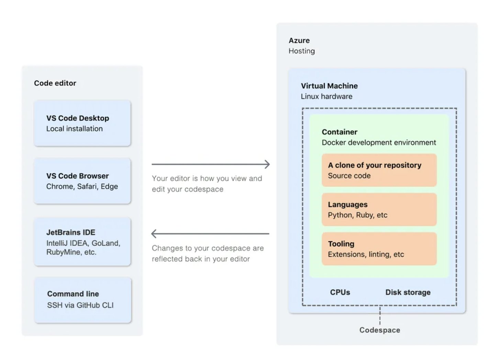

# Codespace: Concept of Virtual Machine

## Goals

1. Get to know concept of Virtual Machine (VM), working with VM by using Terminal
2. Bring everything to VM, so that you can run your code on any machine
3. How all the tools in [DS-project-structure-tools.md](./DS-project-structure-tools.md) makes that process much more smoothly

_Notes:_ I tried to design this experience on Google Colab, though it requires Colab Pro account to access to Terminal. So, decided to use Codespace instead. Technically, you could do the same thing with any browser-based IDE (e.g. Deepnote, Kaggle, etc.) which enables you to access to Terminal.

## What's Virtual Machine?

As data practitioner, you should have heard about _"Container"_, _"Docker"_, _"Cloud"_, _"Virtual machine"_. So, what are they? To enable the collaboration, reproducibility, resusability, or to deal with very large dataset/schedule the pipeline, we need to be able to run your code on any machine. 

> **Virtual machine** (VM), is an always being-on machine, hosted outside of your local machine. It is like a computer in the cloud, that you and others (co-workers, services) can access and run code on it.


Actually, VM is behind everything: Google Colab, Kaggle, Deepnote. AWS, Azure, GCP, etc. as cloud provides - they rents their vast resources of VM. 

> **Codespace** is a virtual machine, hosted by GitHub, that you can access and run code on it.

We use **Codespace** to get you comfortable with the concept of VM. 



Components of VM/Codespace:
- CPUs as resources for computation (running code)
- RAM as resources for in-memory (variables, dataframes, etc.)
- Disk storage for more long-term storage (data, models, etc.)
- Source code (your code)
- Operating system (OS) as the environment (Linux) - access by _Terminal_
- Other tooling (e.g. git, python, etc.)

On left side, you can access to the VM by different Code editors.

## Step-by-step guide
1. Open the Github link: https://github.com/anhdangqb/refactor-notebooks
2. Under the `Code` tab, click on `Codespaces` > `+` button: Create a workspace in the cloud 

> Once creating, the VM would be in-service, till you stop it, other co-workers can also access the same workspace

3. New browsers of `Codespaces` will be opened, and you will see the `VS Code` interface with all codes from Github repo

On `Terminal`, run:

4. Install **gcloud API** (to enable step 6)
```
make cloud_setup
```
5. Start a new terminal (`gcloud` commands should be available)
6. Authorize the connection (so we can `dvc pull` data from Google Storage)
```
make gcloud_auth
```
7. Now, we set-up the project (install all dependencies and pull data)
```
make init_setup
```
8. Check:
  - In folder `01_raw`, data (xlsx file) should be there, just downloaded from gs
  - Run `make run_pipeline`, it will run the pipeline we set-up in `src/pipeline.py`, with the output to `data/02_processed`
