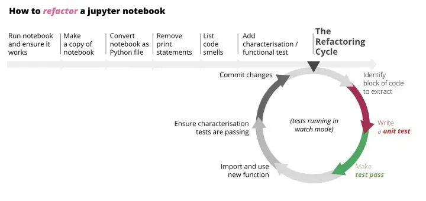

# refactor-notebooks

## Set-up the repo

1. **Version Control**: Init the git repo
2. **Dependencies**:Can reuse existing environment: `conda activate analytics-training-samples`
3. **Data**: Set-up `dvc`
    - Create folder `data/01_raw`: Put the data there
    - `dvc init`
    - Set up remote storage: `dvc remote add -d storage gs://dvc-data-storage` (separate steps to set-up Google Storage and connect local machine to GCP)
    - Turn on autostaging: `dvc config core.autostage true`
    - `dvc add data/01_raw/online_retail.xlsx`
    - `dvc push`


## Overview about the refactoring process



## Converting notebook

> Convert the notebook to script

1. Example notebook: `notebooks/Original_OnlineRetail_Cohort.ipynb`
2. Make a copy: `notebooks/Original_OnlineRetail_Cohort-Copy1.ipynb`
3. On Jupyter notebook:
    - Cell -> All Output -> Clear
    - Run All (To make sure that all cells are in right sequence)
    - Check all results
4. On Terminal, run:
```
jupyter nbconvert notebooks/Original_OnlineRetail_Cohort-Copy1.ipynb --to python
```
5. Check the script output, remove all print/notebook statements: `print(...)`, `df.head()`, `df.describe(...)`, etc.


## Identify code smells

> Read through the code, sketch out the flow, list any code smells

1. Sketch out the flow
    - Ingest & process data
    - Aggregate to have the data input for plotting
    - Plotting the reports
2. List code smells & [Clean code](https://github.com/davified/clean-code-ml) enhancements
3. Leave `# TODO` comments for things to change


## Write / Test / Local module

> Convert codes into DRY functions, write tests, and create local module (which could be imported to notebooks)

1. Create the `src` folder to keep all source codes
2. Create `tests` folder to keep tests for source codes
3. Write/Test follows the Test-driven Development (TDD) approach
    - `tests/test_*.py`: Write the test first, then write the code
    - `pytest`: Run the test, make sure it fails
    - Write the code, make sure it passes
    - Refactor the code, make sure it still passes
4. Structures within source code:
    - `src/`: All source codes
        - `__init__.py`: Empty file to make `src` a module
        - `utils.py`: Utility functions
        - `ingest.py`: All functions to process/clean data
        - `process.py`: All functions to aggregate data
        - `plot.py`: All functions to plot data
    - `tests/`: All tests
        - `__init__.py`: Empty file to make `tests` a module
        - `test_utils.py`: Utility functions for tests
        - `test_ingest.py`: Test for `ingest.py`
        - `test_process.py`: Test for `process.py`
        - `test_plot.py`: Test for `plot.py`
    - Within each test file:
        - Import the functions from local modules (`src` folder)
        - Tests for each function could be organized by `Class` with each test cases as methods (naming corresponding to the function name)
5. Write the code until passing the tests
6. Reformat with `black`
7. Commit to git
8. Pull request to merge to `main` branch

## Import and use new functions on notebook

We refactor codes from the Original noteboks as local modules, and import them to the new notebooks. This will enforce the TDD approach, and reusable of functions across notebooks.

If you reuse local module a lot, consider to convert them to proper Python pkg with `pip` manager

> See: `notebooks/Refactored_OnlineRetail_Cohort.ipynb`
