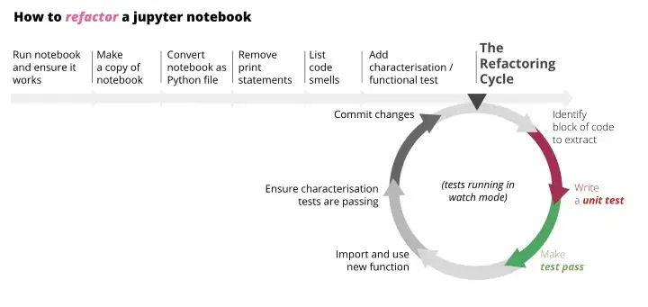

# refactor-notebooks
 
## Set-up the repo

1. **Version Control**: Init the git repo
2. **Dependencies**: Create/activate Conda env: `conda activate analytics-training-samples`
3. **Data**: Set-up `dvc`
    - Create folder `data/01_raw`: Put the data there
    - `dvc init`
    - Set up remote storage: `dvc remote add -d storage gs://dvc-data-storage` (separate steps to set-up Google Storage and connect local machine to GCP)
    - Turn on autostaging: `dvc config core.autostage true`
    - `dvc add data/01_raw/online_retail.xlsx`
    - `dvc push`

## Overview about the refactoring process



### Converting notebook

> Convert the notebook to script

1. Example notebook: `notebooks/Original_OnlineRetail_Cohort.ipynb`
2. Make a copy: `notebooks/Original_OnlineRetail_Cohort-Copy1.ipynb`
3. On Jupyter notebook:
    - Cell -> All Output -> Clear
    - Run All (To make sure that all cells are in right sequence)
    - Check all results
4. On Terminal, run:
```
jupyter nbconvert notebooks/Original_OnlineRetail_Cohort-Copy1.ipynb --to python
```
5. Check the script output, remove all print/notebook statements: `print(...)`, `df.head()`, `df.describe(...)`, etc.


### Identify code smells

> Read through the code, sketch out the flow, list any code smells

1. Sketch out the flow
    - Ingest raw data
    - Process/clean data
    - Aggregate to have the data input for plotting
    - Plotting the reports
2. List code smells & [Clean code](https://github.com/davified/clean-code-ml) enhancements
3. Leave `# TODO` comments for things to change